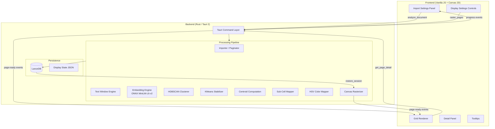
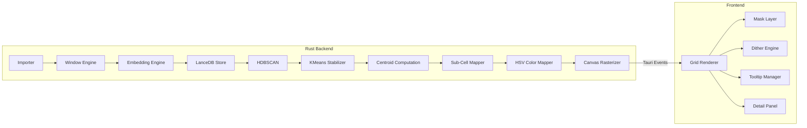
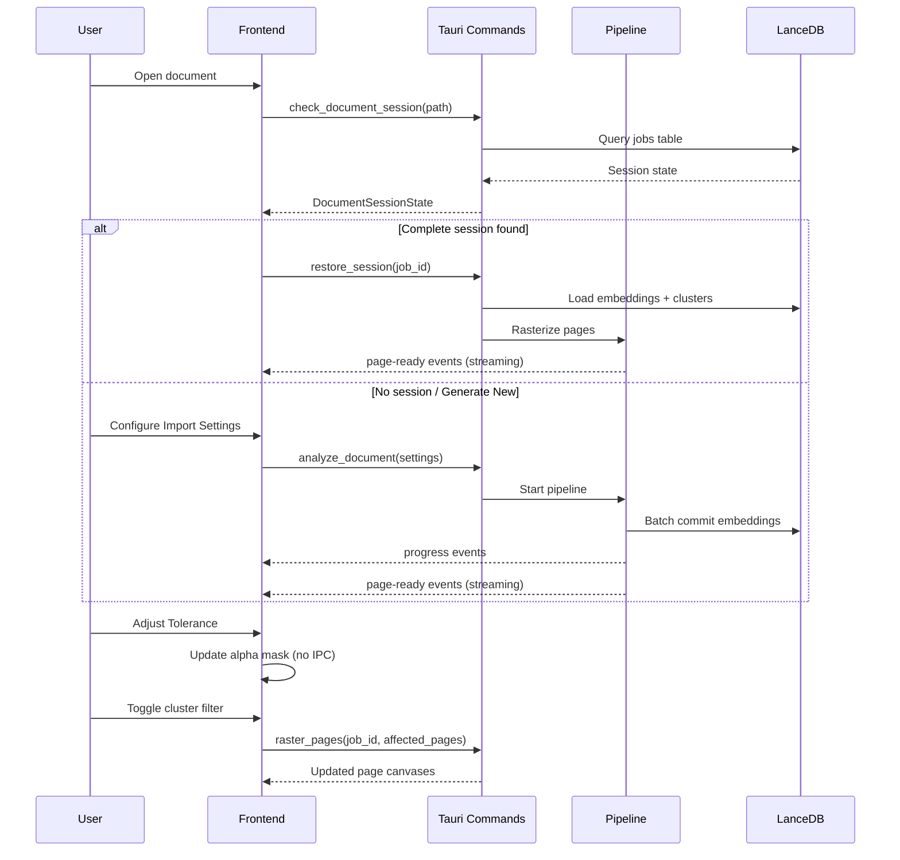
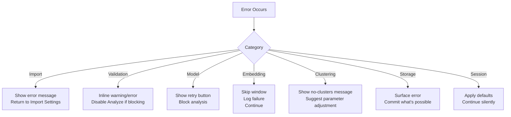

# Design Document

## Overview

The Similarity Map is a Tauri 2 desktop application that detects and visualizes exact and fuzzy phrase repetition within a long-form manuscript. The system processes a document through a multi-stage pipeline — import, windowing, embedding, clustering, sub-cell mapping, and rasterization — to produce a portrait-oriented page grid where each cell is a 20×20 pixel canvas encoding spatial repetition data.

The architecture separates concerns into a Rust backend (heavy computation, ONNX inference, vector storage) and a Vanilla JS frontend (grid rendering, display controls, interactions). Communication flows through Tauri commands (request/response) and events (streaming progress and page canvases).

Key design goals:
- Local-only processing — manuscript text never leaves the machine
- Progressive feedback — grid fills in as pages complete
- Session persistence — completed analyses restore instantly from LanceDB
- Interactive exploration — display settings update without re-running the pipeline

### Romance Factory integration contract

Pipeline-consumable JSON export is defined in **[integration-contract.md](./integration-contract.md)** (RepetitionReport v1). Rust serde types live in `similarity-core/src/contract.rs`; JSON Schema at `similarity-core/schemas/analysis_output_v1.schema.json`; example fixture at `similarity-core/fixtures/analysis_output_v1.example.json`.

## Architecture

### System Architecture Diagram



### Component Architecture



### Data Flow



### Tech Stack

| Layer | Technology | Rationale |
|---|---|---|
| Shell | Tauri 2 (Rust + WebView) | Lightweight desktop, native file access, no Electron overhead |
| Backend | Rust | Performance-critical embedding, clustering, rasterization |
| Embedding | ONNX Runtime (`ort` crate) — `all-MiniLM-L6-v2` | 22 MB model, Apache 2.0, fully offline after download |
| Vector Store | LanceDB (local) | Fast columnar storage, no server, metadata-rich queries |
| Clustering | HDBSCAN (Rust port or Python FFI) | Density-based, no fixed k, noise detection |
| Frontend | Vanilla JS + Canvas 2D | Minimal dependencies, ImageBitmap compositing |
| IPC | Tauri commands + events | Typed Rust→JS streaming for page canvases |

## Components and Interfaces

### Tauri Command Surface

```rust
// === Session Management ===

/// Called on document open. Returns existing sessions for the file.
#[tauri::command]
async fn check_document_session(path: String) -> Result<DocumentSessionState, AppError>;

/// Re-rasters from stored LanceDB data. Streams page-ready events.
#[tauri::command]
async fn restore_session(job_id: String) -> Result<RestoreHandle, AppError>;

/// Deletes all data for a job (windows, job record, display state JSON).
#[tauri::command]
async fn discard_job(job_id: String) -> Result<(), AppError>;

// === Model Management ===

/// Verifies model presence; triggers download if missing.
#[tauri::command]
async fn ensure_embedding_model() -> Result<ModelStatus, AppError>;

// === Analysis ===

/// Returns live estimates without starting analysis.
#[tauri::command]
async fn estimate_analysis(
    path: String,
    window_size: u32,
    stride: u32,
    tokens_per_page: Option<u32>,
) -> Result<AnalysisEstimate, AppError>;

/// Starts the full pipeline. Streams progress + page-ready events.
#[tauri::command]
async fn analyze_document(
    path: String,
    window_size: u32,
    stride: u32,
    tokens_per_page: Option<u32>,
    chapter_break_regex: Option<String>,
    min_repetitions: u32,
    min_samples: u32,
) -> Result<AnalysisHandle, AppError>;

/// Stops at next batch boundary, commits completed work.
#[tauri::command]
async fn cancel_analysis(job_id: String) -> Result<CancelResult, AppError>;

/// Resumes embedding from windows_committed.
#[tauri::command]
async fn resume_analysis(job_id: String) -> Result<AnalysisHandle, AppError>;

// === Display ===

/// Targeted re-raster for cluster filter or gamma changes.
#[tauri::command]
async fn raster_pages(
    job_id: String,
    pages: Vec<u32>,
    threshold: f32,
    gamma: f32,
    hidden_clusters: Vec<i32>,
) -> Result<Vec<PageCanvas>, AppError>;

/// Returns detail data for a specific sub-cell click.
#[tauri::command]
async fn get_page_detail(
    job_id: String,
    page: u32,
    row: u8,
    col: u8,
    threshold: f32,
) -> Result<SubCellDetail, AppError>;
```

### Tauri Events

| Event Name | Payload | Direction | Trigger |
|---|---|---|---|
| `similarity-map:progress` | `{ job_id, stage, pct, windows_done, windows_total, eta_seconds }` | Backend → Frontend | Each embedding batch / stage transition |
| `similarity-map:page-ready` | `{ job_id, page, canvas_rgba_b64 }` | Backend → Frontend | Page rasterization complete |
| `similarity-map:model-download-progress` | `{ pct, bytes_received, total_bytes }` | Backend → Frontend | Model download in progress |
| `similarity-map:model-ready` | `{ path }` | Backend → Frontend | Model download complete |

### Backend Components

#### Importer / Paginator
- **Input**: File path + pagination settings
- **Output**: `Vec<Page>` with character offsets
- **Modes**: PDF (natural breaks via `pdf-extract` crate), Token-count, Chapter-break regex

#### Text Window Engine
- **Input**: `Vec<Page>` + window_size + stride
- **Output**: `Vec<Window>` with page-relative char offsets and sequential window_index
- **Constraint**: Windows never cross page boundaries; terminal windows ≥ 3 tokens

#### Embedding Engine
- **Input**: `Vec<Window>` text
- **Output**: 384-dim f32 vectors, L2-normalized
- **Batch size**: 32 windows per ONNX inference call
- **Checkpoint**: Each batch committed to LanceDB immediately

#### HDBSCAN Clusterer
- **Input**: All embeddings from LanceDB
- **Output**: Cluster labels (≥0) or noise (-1) per window
- **Parameters**: `min_cluster_size` (derived from min_repetitions), `min_samples`

#### KMeans Stabilizer
- **Input**: Non-noise windows with HDBSCAN labels
- **Output**: Stable integer cluster IDs (deterministic via fixed seed + index order)
- **Constraint**: k = number of HDBSCAN clusters; no merging; only clusters with ≥3 members

#### Centroid Computation
- **Input**: Cluster assignments + embeddings
- **Output**: `ClusterRegistry` with centroids, most_central_window_id, page lists

#### Sub-Cell Mapper
- **Input**: Windows with cluster assignments + char offsets
- **Output**: `PageSubGrid` per page (20×20 grid of cluster lists)

#### HSV Color Mapper
- **Input**: ClusterRegistry
- **Output**: Hue lookup table (golden-ratio distribution)

#### Canvas Rasterizer
- **Input**: `PageSubGrid` + color lookup + threshold + gamma + hidden clusters
- **Output**: 20×20 RGBA pixel arrays (1600 bytes each)

### Frontend Components

#### Grid Renderer
- Composites `ImageBitmap` objects into a 10-column CSS grid
- Manages alpha mask layer for Tolerance (no IPC)
- Switches `image-rendering` between `pixelated` and `auto` based on zoom
- Handles progressive population via page-ready events

#### Import Settings Panel
- Exposes all import parameters with live estimates
- Transitions to progress view during analysis
- Shows resume banner for partial jobs

#### Display Settings
- Tolerance slider (frontend-only mask update)
- Cluster Filter toggles (targeted re-raster via IPC)
- Gamma slider (full re-raster via IPC)

#### Detail Panel
- Side panel showing window excerpts, cluster info, counterpart links
- Triggered by macro-cell or sub-cell clicks

#### Tooltip Manager
- Macro-cell tooltips at base zoom (page number, top clusters, max similarity)
- Sub-cell tooltips at ≥5×5 px per sub-cell (position %, cluster, similarity, excerpt)

## Data Models

### LanceDB Schema

#### `windows` Table

| Field | Type | Description |
|---|---|---|
| `window_id` | string (UUID) | Unique window identifier |
| `job_id` | string (UUID) | Parent analysis job |
| `window_index` | u32 | Sequential index within job (0-based); resume key |
| `page` | u32 | 1-based page number |
| `char_start` | u32 | Character offset from start of page text |
| `char_end` | u32 | End of window in page text (exclusive) |
| `doc_char_start` | u32 | Character offset from start of full document |
| `text` | string | Raw window text |
| `embedding` | vector(384) | Float32 embedding (L2-normalized) |
| `cluster_id` | i32 | Stable KMeans cluster label (-1 if noise/unassigned) |
| `hdbscan_label` | i32 | HDBSCAN label (-1 = noise) |
| `sim_to_centroid` | f32 | Cosine similarity to cluster centroid |
| `sub_cell_row` | u8 | Pre-computed sub-cell row (0–19) |
| `sub_cell_col` | u8 | Pre-computed sub-cell col (0–19) |

#### `pages` Table

| Field | Type | Description |
|---|---|---|
| `job_id` | string (UUID) | Parent analysis job |
| `page` | u32 | 1-based page number |
| `doc_char_start` | u32 | Character offset of page start in full document |
| `doc_char_end` | u32 | Character offset of page end in full document |
| `char_count` | u32 | Character count for this page |
| `token_count` | u32 | Approximate token count |
| `pagination_mode` | string | `"pdf"`, `"token"`, or `"chapter"` |

#### `jobs` Table

| Field | Type | Description |
|---|---|---|
| `job_id` | string (UUID) | Unique run identifier |
| `document_path` | string | Absolute path to source file |
| `document_hash` | string (SHA-256) | Hash of file contents for edit detection |
| `settings_hash` | string (SHA-256) | Hash of analysis parameters for resumability |
| `window_size` | u32 | Phrase length used |
| `stride` | u32 | Stride used |
| `tokens_per_page` | Option<u32> | None = PDF natural pages |
| `pagination_mode` | string | `"pdf"`, `"token"`, or `"chapter"` |
| `min_repetitions` | u32 | Minimum cluster recurrences |
| `min_samples` | u32 | HDBSCAN min_samples |
| `chapter_break_re` | Option<String> | Chapter break regex if used |
| `windows_total` | u32 | Total windows planned |
| `windows_committed` | u32 | Windows successfully embedded |
| `status` | string | `"running"`, `"partial"`, `"complete"`, `"discarded"` |
| `created_at` | timestamp | When analysis started |
| `updated_at` | timestamp | Last batch commit or status change |

### In-Memory Structures (Rust)

```rust
/// A single page from the imported document.
struct Page {
    page_num: u32,          // 1-based
    text: String,
    char_offset_in_doc: u32,
    char_count: u32,
    token_count: u32,
    pagination_mode: PaginationMode,
}

enum PaginationMode { Pdf, Token, Chapter }

/// A text window — the atomic unit of comparison.
struct Window {
    window_id: String,      // UUID
    window_index: u32,      // sequential across job
    page: u32,              // 1-based page number
    char_start: u32,        // page-relative
    char_end: u32,          // page-relative, exclusive
    doc_char_start: u32,    // document-relative
    text: String,
}

/// 20×20 grid of sub-cells for one page.
struct PageSubGrid {
    page: u32,
    cells: [[SubCell; 20]; 20],
}

struct SubCell {
    /// Clusters present, sorted by sim_to_centroid desc. Capped at 8.
    clusters: Vec<SubCellCluster>,
}

struct SubCellCluster {
    cluster_id: i32,
    sim_to_centroid: f32,
    window_id: String,      // best-matching window for tooltip lookup
}

/// Cluster metadata registry.
struct ClusterRegistry {
    clusters: HashMap<i32, ClusterInfo>,
}

struct ClusterInfo {
    cluster_id: i32,
    hue: f32,                        // golden-ratio assigned: (id × 0.6180339887) mod 1.0
    centroid: Vec<f32>,              // mean of member embeddings (384-dim)
    most_central_window_id: String,  // highest cosine sim to centroid
    most_central_window_text: String,
    member_count: u32,
    pages: Vec<u32>,                 // sorted page numbers where cluster appears
}

/// Flat RGBA pixel array for a single page cell.
struct PageCanvas {
    page: u32,
    pixels: [u8; 1600],    // 20×20×4 RGBA, row-major
}

/// Display state persisted as sidecar JSON.
struct DisplayState {
    job_id: String,
    tolerance: f32,         // 0.75–1.00, default 0.88
    gamma: f32,             // 0.5–3.0, default 1.5
    hidden_clusters: Vec<i32>,
    zoom: f32,              // default 1.0
    scroll_x: f32,
    scroll_y: f32,
    saved_at: String,       // ISO 8601 timestamp
}
```

### IPC Response Types

```rust
struct DocumentSessionState {
    complete_job: Option<CompleteJobInfo>,
    partial_job: Option<PartialJobInfo>,
}

struct CompleteJobInfo {
    job_id: String,
    created_at: String,
    page_count: u32,
    window_size: u32,
    stride: u32,
    tokens_per_page: Option<u32>,
    pagination_mode: String,
}

struct PartialJobInfo {
    job_id: String,
    windows_committed: u32,
    windows_total: u32,
    pct: f32,
    cancelled_at: String,
    window_size: u32,
    stride: u32,
    tokens_per_page: Option<u32>,
}

struct AnalysisHandle {
    job_id: String,
    page_count: u32,
    window_count: u32,
    pagination_mode: String,
}

struct AnalysisEstimate {
    page_count: u32,
    window_count: u32,
    eta_seconds: f32,
    benchmark_windows_per_sec: f32,
}

struct ModelStatus {
    present: bool,
    path: String,
    size_mb: f32,
}

struct CancelResult {
    windows_committed: u32,
    status: String,  // "partial" or "discarded"
}

struct RestoreHandle {
    job_id: String,
    page_count: u32,
}

struct SubCellDetail {
    window_text: String,
    cluster_id: i32,
    similarity: f32,
    matches: Vec<WindowMatch>,
}

struct WindowMatch {
    page: u32,
    window_text: String,
    similarity: f32,
    sub_cell_row: u8,
    sub_cell_col: u8,
}
```

### Algorithms

#### Sub-Cell Position Calculation

```rust
fn compute_sub_cell(char_start: u32, char_end: u32, page_char_count: u32) -> (u8, u8) {
    let midpoint = (char_start + char_end) / 2;
    let linear_index = ((midpoint as f64 / page_char_count as f64) * 400.0).floor() as u32;
    let clamped = linear_index.min(399);
    let row = (clamped / 20) as u8;
    let col = (clamped % 20) as u8;
    (row, col)
}
```

#### HSV Color Assignment

```rust
fn cluster_hue(cluster_id: i32) -> f32 {
    ((cluster_id as f64 * 0.6180339887) % 1.0) as f32
}

fn compute_value(sim_to_centroid: f32, gamma: f32) -> f32 {
    sim_to_centroid.max(0.0).powf(gamma)
}

fn cluster_color(cluster_id: i32, sim_to_centroid: f32, gamma: f32) -> (f32, f32, f32) {
    let h = cluster_hue(cluster_id);
    let s = 1.0;
    let v = compute_value(sim_to_centroid, gamma);
    hsv_to_linear_rgb(h, s, v)
}
```

#### Similarity-Weighted Color Blending

```rust
fn blend_sub_cell(
    clusters: &[SubCellCluster],
    gamma: f32,
    threshold: f32,
    hidden: &HashSet<i32>,
) -> [u8; 4] {
    let visible: Vec<_> = clusters.iter()
        .filter(|c| c.sim_to_centroid >= threshold && !hidden.contains(&c.cluster_id))
        .take(8)
        .collect();

    if visible.is_empty() {
        return [0, 0, 0, 0]; // transparent
    }

    let mut r = 0.0f32;
    let mut g = 0.0f32;
    let mut b = 0.0f32;
    let mut total_weight = 0.0f32;

    for c in &visible {
        let weight = c.sim_to_centroid.powf(gamma);
        let (cr, cg, cb) = cluster_color(c.cluster_id, c.sim_to_centroid, gamma);
        r += weight * cr;
        g += weight * cg;
        b += weight * cb;
        total_weight += weight;
    }

    if total_weight == 0.0 {
        return [0, 0, 0, 0];
    }

    linear_to_srgb_rgba(r / total_weight, g / total_weight, b / total_weight, 1.0)
}
```

#### Canvas Rasterization Loop

```rust
fn rasterize_page(
    grid: &PageSubGrid,
    registry: &ClusterRegistry,
    gamma: f32,
    threshold: f32,
    hidden: &HashSet<i32>,
) -> PageCanvas {
    let mut pixels = [0u8; 1600];

    for row in 0..20usize {
        for col in 0..20usize {
            let sub_cell = &grid.cells[row][col];
            let color = blend_sub_cell(&sub_cell.clusters, gamma, threshold, hidden);
            let offset = (row * 20 + col) * 4;
            pixels[offset..offset + 4].copy_from_slice(&color);
        }
    }

    PageCanvas { page: grid.page, pixels }
}
```

#### HDBSCAN min_cluster_size Derivation

```rust
fn derive_min_cluster_size(min_repetitions: u32, phrase_length: u32, stride: u32) -> u32 {
    let windows_per_phrase = (phrase_length / stride).max(1);
    min_repetitions * windows_per_phrase
}
```

#### Window Count Estimation

```rust
fn estimate_window_count(total_tokens: u32, window_size: u32, stride: u32) -> u32 {
    if total_tokens <= window_size {
        return if total_tokens >= 3 { 1 } else { 0 };
    }
    ((total_tokens - window_size) / stride) + 1
}
```


## Correctness Properties

*A property is a characteristic or behavior that should hold true across all valid executions of a system — essentially, a formal statement about what the system should do. Properties serve as the bridge between human-readable specifications and machine-verifiable correctness guarantees.*

### Property 1: Pagination character span round-trip

*For any* plain-text document and any valid `tokens_per_page` value (200–2000), paginating the text and then concatenating all page character spans (`text[page.doc_char_start..page.doc_char_end]`) SHALL reproduce the original document content exactly.

**Validates: Requirements 2.1, 2.2, 2.3**

### Property 2: Chapter break pagination respects max page size

*For any* plain-text document with chapter break markers matching a given regex and any `tokens_per_page` cap, every page produced by chapter-break pagination SHALL contain at most `tokens_per_page` tokens (chapters exceeding the cap are split at the overflow point).

**Validates: Requirements 3.1, 3.2**

### Property 3: Window generation invariants

*For any* page text, valid `window_size` (5–1500), and valid `stride` (1–200), the Text Window Engine SHALL produce windows where: (a) each non-terminal window contains exactly `window_size` tokens, (b) extracting `page_text[char_start..char_end]` for any window reproduces that window's text exactly, (c) no window's `char_end` exceeds the page's character count, and (d) `window_index` values across the entire job form a contiguous sequence starting at 0.

**Validates: Requirements 4.1, 4.2, 4.3, 4.4, 4.6**

### Property 4: Embedding produces unit-length 384-dimensional vectors

*For any* text window of any token length (1–1500), the Embedding Engine SHALL produce a 384-dimensional float32 vector whose L2 norm is within ε (1e-5) of 1.0, truncating inputs exceeding 256 tokens before inference.

**Validates: Requirements 5.1, 5.6**

### Property 5: Embedding batch commit pattern

*For any* set of N windows, the Embedding Engine SHALL commit them to LanceDB in batches of exactly 32 (with the final batch containing N mod 32 windows if N is not evenly divisible), and the total committed window count SHALL equal N.

**Validates: Requirements 5.4**


### Property 6: Time estimate formula

*For any* positive window count and positive benchmark throughput (windows/sec), the estimated embedding time SHALL equal `window_count / benchmark_windows_per_sec` seconds, and the window count estimate SHALL equal `floor((total_tokens - window_size) / stride) + 1` for documents with more tokens than `window_size`.

**Validates: Requirements 6.2, 6.3**

### Property 7: HDBSCAN min_cluster_size derivation

*For any* valid `min_repetitions` (2–20), `phrase_length` (5–1500), and `stride` (1–200), the derived `min_cluster_size` SHALL equal `min_repetitions × max(1, floor(phrase_length / stride))`.

**Validates: Requirements 7.3**

### Property 8: KMeans stabilization determinism and completeness

*For any* set of non-noise windows with HDBSCAN-assigned cluster labels, running KMeans with a fixed seed in `window_index` order SHALL: (a) produce exactly k distinct cluster IDs where k equals the number of HDBSCAN clusters with ≥3 members, (b) produce identical assignments when run twice on the same input, and (c) never merge or collapse clusters.

**Validates: Requirements 8.1, 8.2, 8.3, 8.4**

### Property 9: Centroid computation correctness

*For any* cluster with N member embeddings (N ≥ 3), the computed centroid SHALL equal the element-wise arithmetic mean of all member embeddings, and the `most_central_window_id` SHALL be the member with the highest cosine similarity to that centroid (ties broken by lowest `window_index`). The cluster-to-pages index SHALL contain exactly the sorted set of page numbers where at least one member window appears.

**Validates: Requirements 9.1, 9.2, 9.4**

### Property 10: Sub-cell mapping correctness

*For any* non-noise window with `char_start`, `char_end`, and `page_char_count > 0`, the sub-cell position SHALL be computed as `linear_index = clamp(floor(midpoint / page_char_count × 400), 0, 399)` where `midpoint = floor((char_start + char_end) / 2)`, with `row = linear_index / 20` and `col = linear_index % 20`. Noise windows (cluster_id = -1) SHALL NOT appear in any sub-cell. Each sub-cell's cluster list SHALL be sorted by `sim_to_centroid` descending and capped at 8 entries.

**Validates: Requirements 10.1, 10.2, 10.3, 10.4, 10.5**


### Property 11: HSV color encoding rules

*For any* cluster_id and `sim_to_centroid` value, the HSV color SHALL satisfy: (a) `hue = (cluster_id × 0.6180339887) mod 1.0`, (b) saturation = 1.0, (c) `value = max(0.0, sim_to_centroid) ^ gamma`, (d) pixels with a valid cluster have alpha = 1.0 (255), and (e) pixels for noise windows or empty sub-cells have alpha = 0 (transparent).

**Validates: Requirements 11.1, 11.2, 11.3, 11.4, 11.5, 11.6**

### Property 12: Canvas rasterization color blending

*For any* sub-cell containing one or more clusters above the threshold, the rasterized pixel SHALL be computed as: for a single cluster, the direct HSV→sRGB conversion; for multiple clusters (up to 8), the similarity-weighted linear-RGB blend where `weight[i] = sim_to_centroid[i] ^ gamma`, normalized to sum to 1.0, then converted from linear RGB to sRGB. Sub-cells where all clusters are below threshold or all clusters are hidden SHALL render as transparent (alpha = 0). The output canvas SHALL be exactly 1600 bytes (20×20×4 RGBA, row-major).

**Validates: Requirements 12.1, 12.2, 12.3, 13.1, 13.3**

### Property 13: Tolerance mask correctness

*For any* page's sub-cell data and any tolerance value (0.75–1.00), the alpha mask SHALL set a pixel to visible (alpha = 1) if and only if the highest `sim_to_centroid` among all clusters in that sub-cell exceeds the tolerance value, with no backend IPC required for the computation.

**Validates: Requirements 16.2, 16.3**

### Property 14: Cluster filter targeted re-rasterization

*For any* cluster toggle event, the set of pages re-rasterized SHALL equal exactly the pages listed in that cluster's `cluster-to-pages` index. When all clusters in a sub-cell are hidden, that pixel SHALL render as transparent.

**Validates: Requirements 17.2, 17.3, 17.4, 29.2**

### Property 15: Display state persistence round-trip

*For any* valid display state (tolerance 0.75–1.00, gamma 0.5–3.0, hidden_clusters list, zoom > 0, scroll_x/y ≥ 0), serializing to the sidecar JSON and then deserializing SHALL produce an identical display state. When the JSON is missing or corrupt, default values (tolerance 0.88, gamma 1.5, no hidden clusters, zoom 1.0, scroll 0,0) SHALL be applied.

**Validates: Requirements 22.4, 23.1, 22.6**

### Property 16: Settings and document hash determinism

*For any* set of analysis parameters (window_size, stride, tokens_per_page, min_repetitions, min_samples), the `settings_hash` (SHA-256) SHALL be deterministic — identical parameters always produce the same hash, and any parameter change produces a different hash. Similarly, *for any* file content, `document_hash` (SHA-256) SHALL be deterministic and SHALL change when file content changes.

**Validates: Requirements 26.2, 26.3, 21.5**

### Property 17: Cancellation preserves committed work

*For any* cancellation event during embedding, all fully-committed batches SHALL remain in LanceDB with correct data, the job status SHALL be "partial" if at least one batch was committed (otherwise "discarded"), and the `windows_committed` count SHALL accurately reflect the number of windows persisted.

**Validates: Requirements 20.3, 20.4**

### Property 18: Resume skips completed work

*For any* partial job with `windows_committed` = M out of `windows_total` = N, resuming SHALL embed only windows with `window_index` ≥ M, and progress percentage SHALL be computed as `(current - M) / (N - M)` rather than `current / N`.

**Validates: Requirements 21.2, 21.6**


## Error Handling

### Error Categories

| Category | Examples | Strategy |
|---|---|---|
| **Import Errors** | Corrupt PDF, empty file, unreadable file | Display error message, return to Import Settings Panel, no partial state created |
| **Validation Errors** | Invalid regex, out-of-range parameters, tokens_per_page < 4× phrase_length | Inline UI warnings/errors, prevent analysis start for blocking errors |
| **Model Errors** | Missing model, corrupt model (hash mismatch), download failure | Retry mechanism with progress; block analysis until model available |
| **Embedding Errors** | Individual window embedding failure | Skip failed windows, log window_index, continue processing remaining batches |
| **Clustering Errors** | All windows assigned as noise (no clusters found) | Report to user with guidance to lower Min Repetitions or Min Samples |
| **Storage Errors** | LanceDB write failure, disk full | Surface error to user, attempt graceful degradation (commit what's possible) |
| **Session Errors** | Missing display state JSON, corrupt session data | Apply defaults silently; never block the user from proceeding |

### Error Flow



### Specific Error Behaviors

1. **PDF parse failure** (Req 1.4): Display error identifying the failure reason, return to Import Settings Panel without starting analysis.

2. **Empty/whitespace-only file** (Req 2.5): Display "no analyzable text" error, do not create any pages.

3. **Invalid chapter break regex** (Req 3.5): Inline error below regex field, disable Analyze button until corrected or cleared.

4. **Embedding batch failure** (Req 5.7): Skip failed windows in the batch, log their `window_index` values, continue with remaining batches. The final `windows_committed` count reflects only successfully embedded windows.

5. **Benchmark probe failure** (Req 6.6): Display "estimate unavailable" in place of time estimate, do not block analysis.

6. **No clusters found** (Req 7.6): Report outcome to user indicating Min Repetitions or Min Samples should be lowered. The grid renders as entirely transparent (no repetition detected).

7. **Model download failure** (Req 27.4): Display error with Retry button, prevent analysis from starting until model is available.

8. **Corrupt model file** (Req 27.5): Delete corrupt file, re-download automatically.

9. **Missing display state JSON** (Req 22.6): Apply default display settings silently on session restore.

10. **Document hash mismatch on resume** (Req 21.5): Auto-discard partial job, display inline message explaining the document was edited.

## Testing Strategy

### Dual Testing Approach

The Similarity Map feature uses both property-based tests and example-based unit tests for comprehensive coverage:

**Property-Based Tests (PBT):**
- Validate universal invariants across randomly generated inputs
- Use the `proptest` crate (Rust) for backend logic
- Minimum 100 iterations per property test
- Each test references its design document property via tag comment
- Tag format: `// Feature: similarity-map, Property {N}: {title}`

**Example-Based Unit Tests:**
- Cover specific scenarios, edge cases, and error conditions
- Verify UI behavior and integration points
- Test error handling paths with mocked failures

### Property-Based Testing Configuration

- **Library**: `proptest` (Rust crate) for all backend properties
- **Iterations**: Minimum 100 per property (configurable via `PROPTEST_CASES` env var)
- **Generators**: Custom `Arbitrary` implementations for `Page`, `Window`, `SubCellCluster`, `ClusterInfo`
- **Shrinking**: Enabled for all generators to produce minimal failing examples

### Test Coverage Matrix

| Property | Component Under Test | Generator Strategy |
|---|---|---|
| 1: Pagination round-trip | Importer/Paginator | Random Unicode text (1–50,000 chars) × tokens_per_page (200–2000) |
| 2: Chapter break max cap | Importer/Paginator | Text with random chapter markers × tokens_per_page |
| 3: Window invariants | Text Window Engine | Random page text × window_size × stride |
| 4: Embedding dimensions | Embedding Engine | Random text strings (1–2000 tokens) |
| 5: Batch commit pattern | Embedding Engine | Random window counts (1–1000) |
| 6: Time estimate formula | Estimation logic | Random (window_count, throughput) pairs |
| 7: min_cluster_size derivation | HDBSCAN config | Random (min_reps, phrase_length, stride) triples |
| 8: KMeans determinism | KMeans Stabilizer | Random embedding sets with known cluster structure |
| 9: Centroid correctness | Centroid Computation | Random 384-dim vectors grouped into clusters |
| 10: Sub-cell mapping | Sub-Cell Mapper | Random (char_start, char_end, page_char_count) triples |
| 11: HSV encoding | HSV Color Mapper | Random (cluster_id, sim_to_centroid, gamma) triples |
| 12: Color blending | Canvas Rasterizer | Random sub-cell cluster lists (1–12 entries) × gamma × threshold |
| 13: Tolerance mask | Frontend mask logic | Random sub-cell data × tolerance values |
| 14: Cluster filter | Rasterizer + Registry | Random cluster registries × toggle events |
| 15: Display state round-trip | Persistence layer | Random DisplayState structs |
| 16: Hash determinism | Hash utilities | Random parameter sets and file contents |
| 17: Cancellation invariants | Pipeline + LanceDB | Random cancellation points during simulated embedding |
| 18: Resume correctness | Resume logic | Random partial job states |

### Integration Tests

- **Full pipeline end-to-end**: Import a known document, run full analysis, verify grid output matches expected patterns
- **Session restore**: Complete analysis, close app, reopen, verify restore produces identical canvases
- **Cancel and resume**: Start analysis, cancel at various points, resume, verify final output matches fresh run
- **Model download**: Test with missing model, verify download and caching
- **Event streaming**: Verify progress and page-ready events arrive in correct order with valid payloads

### Performance Tests

- **Tolerance slider latency**: Verify alpha mask update completes within 16ms for 300 pages
- **Rasterization throughput**: Verify 300 pages rasterize in under 1 second
- **Memory usage**: Verify grid memory stays under 500 KB for 300 pages (1600 bytes × 300 = 480 KB)

### Frontend Tests

- **Grid layout**: Verify 10-column arrangement and correct row count for various page counts
- **Zoom behavior**: Verify `image-rendering` switches at 100px threshold
- **Tooltip display**: Verify correct tooltip type (macro vs sub-cell) at different zoom levels
- **Dither patterns**: Verify correct pattern selection for 2, 3, 4, 5–8 cluster counts at zoom
