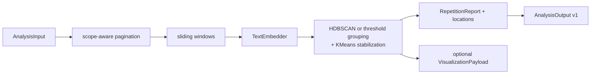
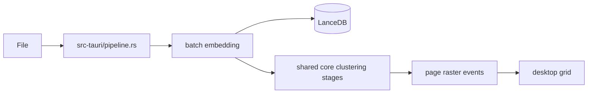

# Similarity Map Architecture

Last verified: 2026-07-14 (lexical primary pass landed).

## Design direction

Similarity Map is a Rust workspace with a reusable analysis core and three adapters.
The Tauri desktop application is one consumer of the core, not the owner of the
analysis model.

```text
similarity-map
├── similarity-core      shared library
├── similarity-cli       JSON/stdin and Romance Factory story adapter → core
├── similarity-core-py   PyO3 adapter → core
├── src-tauri            desktop IPC, persistence, and events → core
└── src                  vanilla JavaScript UI → Tauri IPC
```

The intended dependency direction is one way: adapters depend on
`similarity-core`; the core has no Tauri, WebView, Python, or CLI dependency.

## Workspace components

### `similarity-core`

Portable repetition-analysis library. Important modules:

- `analyze_prose.rs` — in-memory single-pass orchestration and `TextEmbedder`
- `lexical.rs` — deterministic lexical shingle detector (RF primary pass)
- `multi_pass.rs` — act/chapter pass bundles (`PassMethod::{Lexical,Embedding}`),
  lexical-first RF defaults (`min_repetitions: 2`), and deterministic report merge
- `contract.rs` — `AnalysisOutput` v1 and validation
- `report.rs` / `spans.rs` — editorial spans, structural locations, and suggested
  operations
- `rf_story.rs` — Romance Factory draft discovery and chapter scope construction
- `importer.rs` / `windowing.rs` — pagination and sliding token windows
- `embedding.rs` / `ort_runtime.rs` / `model.rs` — ONNX inference and model handling
- `clustering.rs` / `centroid.rs` / `analysis.rs` — HDBSCAN, stabilization, and
  cluster artifacts
- `subcell.rs` / `color.rs` / `rasterizer.rs` — 20×20 page visualization
- `storage/` — LanceDB schemas and CRUD used by the desktop persistence path
- `visualization.rs` — UI-oriented `VisualizationPayload`

The public integration boundary is `AnalysisOutput` v1. It contains scope metadata,
all pass reports, and one merged repetition report. Its JSON Schema and example fixture
live under `similarity-core/schemas/` and `similarity-core/fixtures/`. Lexical passes
do not bump the schema; they use stable `pass_id` / `pass_label` provenance.

### `similarity-cli`

Headless process adapter. It accepts:

- a JSON request on stdin or through `--input-file`;
- a Romance Factory story path plus chapter number;
- an optional YAML pass bundle;
- an ONNX model path or the deterministic test embedder.

Successful stdout is a validated, pretty-printed `AnalysisOutput` v1 document. Logs and
errors go to stderr so subprocess consumers can parse stdout directly.

### `similarity-core-py`

PyO3 adapter exposing `analyze_prose` and `analyze_prose_multi_pass` as Python
functions. Inputs and outputs cross the boundary as JSON-compatible dictionaries. The
binding supports the deterministic embedder for offline contract tests.

### `src-tauri`

Desktop adapter. It owns:

- Tauri command registration and event emission;
- app-data path resolution;
- file-based LanceDB jobs, cancellation, resume, and restore;
- display-state, result-catalog, and app-setting JSON sidecars;
- model-download progress surfaced to the UI.

It registers 27 commands in `src-tauri/src/lib.rs`. These cover sessions, model
management, file/text/RF analysis, raster/query operations, saved results, app/display
settings, and `AnalysisOutput` serialization.

### `src`

Static vanilla JavaScript and CSS served directly by Tauri. There is no Node package or
frontend build step. The UI provides file import, RF story/chapter selection, progress,
page-grid rendering, text highlights, result aliases, display controls, settings YAML
export, and `AnalysisOutput` export.

## Analysis flows

### Headless single-pass



`analyze_prose` runs entirely in memory. The caller supplies a `TextEmbedder`, which
allows ONNX production inference or deterministic offline tests.

### Headless multi-pass

`analyze_prose_multi_pass` executes configured act-scoped and chapter-scoped passes,
then merges clusters when instance spans overlap by at least 50% of the shorter span.
The default Romance Factory bundle prepends a chapter-scoped lexical primary pass, then
runs two fine act embedding passes and two coarser chapter embedding passes. Lexical-only
bundles may omit the embedder entirely.

### Persistent desktop file analysis



This route exists because it checkpoints embeddings and emits progress/cancellation
events. It now also runs a lexical primary pass after import and writes
`sessions/<job_id>.analysis_output.json` for RF export / text highlights. Embedding
windows remain the LanceDB grid source of truth.

### Desktop text and RF chapter analysis

`analyze_text` calls the headless core in memory. `analyze_rf_chapter` runs the
multi-pass core for `AnalysisOutput`, then currently performs another display pass to
build visualization artifacts. These paths do not create persistent LanceDB sessions.

## Data and persistence

The desktop app resolves data beneath Tauri's app-data directory for identifier
`com.similarity-map.app`:

- `models/all-MiniLM-L6-v2.onnx`
- `similarity_map_db/` — LanceDB `jobs`, `pages`, and `windows`
- `sessions/<job_id>.json` — display state
- `results/<document-hash>.json` — named result aliases
- app settings JSON
- benchmark cache

The headless adapters do not require LanceDB. Production ONNX runs need both the model
file and a compatible ONNX Runtime shared library.

## Contract boundaries

Use the following boundaries for new integrations:

- **Pipeline/editor integration:** `AnalysisOutput` v1
- **Desktop rendering and text highlighting:** `VisualizationPayload`
- **Incremental desktop persistence:** LanceDB job/page/window rows
- **User display preferences and aliases:** Tauri-owned JSON sidecars

Do not make downstream consumers depend on LanceDB internals or Tauri commands when the
versioned contract is sufficient.

## Current convergence work

The application should be evolved around the existing core, not rewritten:

1. use the model's real tokenizer in `embedding.rs`;
2. fail closed on missing embeddings in every adapter;
3. reuse multi-pass artifacts for RF visualization instead of embedding twice;
4. move remaining shared orchestration out of `src-tauri/src/pipeline.rs` while keeping
   checkpoints and events in the desktop adapter;
5. implement query/detail behavior in the core so Tauri commands remain thin;
6. keep adapter-specific persistence policies explicit.

See `CURRENT-STATE.md` for verified tests, limitations, and the prioritized backlog.
