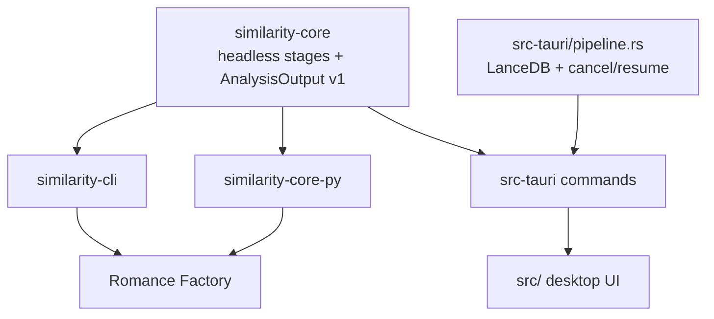

# Similarity Map — Current State

Last verified: 2026-07-14 against `b097f7d`.

This document describes the implementation that exists today. The older design and
requirements documents are useful historical baselines, but they include intended UI
behavior that is not currently wired.

## Utility verdict

Similarity Map has two distinct kinds of utility:

1. **A reusable repetition-analysis platform.** `similarity-core` exposes an in-memory
   analysis API, a four-pass Romance Factory workflow, and a versioned
   `AnalysisOutput` JSON contract. The same core is used by a CLI, PyO3 bindings, and
   parts of the Tauri app.
2. **A desktop manuscript explorer.** The Tauri app imports PDF or text manuscripts,
   persists file-based analyses in LanceDB, renders a 20×20 spatial raster for each
   page, supports display filtering, and restores completed or partial jobs.

The reusable/core direction is the strongest part of the project. A ground-up rebuild
is not warranted: the rebuild around `similarity-core` is already substantially
complete. Remaining work should converge the desktop's legacy persistent pipeline with
the headless core and finish or remove incomplete UI paths.

## Implemented surfaces

| Surface | Current role | Verification |
|---|---|---|
| `similarity-core` | Headless analysis, clustering, reports, visualization payloads, multi-pass merge, v1 contract | 270 tests passed |
| `similarity-cli` | JSON/stdin or RF-story analysis; `AnalysisOutput` JSON on stdout | 2 integration smoke tests passed |
| `similarity-core-py` | PyO3 `analyze_prose` and `analyze_prose_multi_pass` bindings | 2 Rust-side tests passed |
| `src-tauri` | Desktop IPC, file analysis, LanceDB sessions, app settings, result catalog | 33 tests passed |
| `src/` | Vanilla JS grid, import/display controls, RF chapter presets, text preview, exports | No automated frontend test suite |

`cargo check --workspace` passes. `cargo test --workspace` currently does not complete
because the unit-test module in `similarity-cli/src/analyze.rs` calls
`build_scope_manifest` without importing it. The CLI binary and its integration smoke
test compile and pass; this is a test-target defect rather than a runtime compile
failure.

The separate three-test Python `pytest` suite under `similarity-core-py/tests/`
requires an installed `maturin` development extension and was not executed in this
review.

## Important correctness limit

The production ONNX path does **not** yet use the tokenizer required by
`all-MiniLM-L6-v2`. `similarity-core/src/embedding.rs` splits on whitespace and maps
tokens to hash-derived pseudo vocabulary IDs. The source itself labels this as a
placeholder for WordPiece tokenization.

Consequences:

- exact and strongly lexical repetition can still produce useful visual structure;
- contract, pagination, clustering, merge, and adapter behavior are well covered by
  deterministic offline tests;
- paraphrase-level or benchmark-grade semantic similarity is **not validated**;
- production similarity thresholds should be treated as heuristic until a real
  MiniLM tokenizer is integrated and checked against reference embeddings.

The deterministic test embedder is intentionally non-semantic. It verifies pipeline
shape and contract behavior, not production embedding quality.

## Current architecture

There are currently two desktop analysis routes:

- `analyze_document` uses `src-tauri/src/pipeline.rs` for incremental LanceDB writes,
  events, cancellation, and resume.
- `analyze_text` and `analyze_rf_chapter` call the headless core in memory. They return
  visualization/contract data but do not create restorable LanceDB jobs.

The split is intentional in part—persistence and Tauri events belong in an adapter—but
shared analysis behavior should continue moving into the core.

## Known gaps

### Correctness and trust

- Replace hash-based pseudo-tokenization with the model's real WordPiece tokenizer.
- Reject or remove failed desktop embedding batches before clustering. The headless
  path rejects missing embeddings; the persistent Tauri pipeline can leave empty
  vectors and continue.
- Persist and restore `enable_hdbscan` and `link_subphrases`; resume currently falls
  back to fixed values.
- Add a model checksum. Current model validation is based on file-size bounds.

### Architecture

- Avoid re-embedding an RF chapter after multi-pass analysis solely to build the grid.
- Make the persistent desktop pipeline an adapter over shared core stages rather than a
  second orchestration implementation.
- Decide whether pasted-text and RF-chapter UI runs should participate in saved
  results/session restore.
- Treat `AnalysisOutput` v1 as the primary pipeline contract; keep
  `VisualizationPayload` as the UI-oriented representation.

### Desktop UI and packaging

- `get_page_detail` is registered and invoked by the detail panel but still contains
  `todo!()`. Grid-cell drill-down is therefore not complete.
- `tooltip.js`, `tolerance.js`, and `dither.js` exist but are not mounted by `main.js`.
  Tolerance currently triggers backend re-rasterization.
- The page grid wraps to available width; it is not a fixed ten-column layout.
- First-run benchmark code exists, but the app only reads a cached benchmark when
  estimating work.
- `src-tauri/tauri.conf.json` references bundle icons that are not present in
  `src-tauri/icons/`.

## Recommended next sequence

1. Integrate a real MiniLM tokenizer and add reference-vector tests.
2. Make desktop embedding failures fail closed before clustering.
3. Remove the duplicate RF chapter embedding pass.
4. Implement `get_page_detail`, then either wire or remove tooltip/tolerance/dither
   modules.
5. Persist all analysis settings used by resume.
6. Continue thinning `src-tauri/src/pipeline.rs` around shared core stages.
7. Add bundle icons and an in-repository CI workflow.

## Documentation map

- `README.md` — user entry point, setup, and adapter usage
- `ARCHITECTURE.md` — crate boundaries, data flows, and migration direction
- `.kiro/specs/similarity-map/integration-contract.md` — canonical
  `AnalysisOutput` v1 integration contract
- `Similarity Map - Design Specification.md` — historical/aspirational desktop design
- `.kiro/specs/similarity-map/requirements.md` and `tasks.md` — requirement history and
  implementation checklist, with current-state addenda
