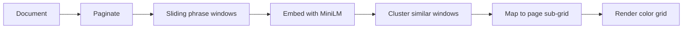

# Similarity Map

A visual tool for spotting repeated phrases and motifs in long-form prose — at a glance, across the whole manuscript, and down to the exact spot on each page.

Part of the **Romance Factory** manuscript tooling ecosystem.

## What it does

Upload a novel or long document and get a **repetition fingerprint**: a portrait-oriented grid where each cell is one page. Color shows *what* is repeating; brightness shows *how closely* it matches; position within each cell shows *where on the page* it appears.

The map helps authors and editors answer questions like:

- Which pages recycle the same phrases or scene beats?
- Is repetition clustered in one chapter or spread throughout?
- Are echoes exact duplicates, near-identical wording, or paraphrases?

## How it looks

The macro-grid is **10 columns wide** (like an open book), with rows growing with page count. Each page cell is a **20×20 pixel canvas** — one pixel per sub-region of the page, so you see both *that* a page repeats something and *where* on that page.

```
  page 1    page 2    page 3    ...    page 10
 ┌────────┐ ┌────────┐ ┌────────┐       ┌────────┐
 │ 20×20  │ │ 20×20  │ │ 20×20  │  ...  │ 20×20  │
 │ pixels │ │ pixels │ │ pixels │       │ pixels │
 └────────┘ └────────┘ └────────┘       └────────┘
```

**Color (hue)** — cluster identity: each recurring phrase/motif gets a distinct color.  
**Brightness (value)** — how archetypal the match is (brighter = closer to the cluster's core phrasing).  
**Empty pixels** — no repetition above the current threshold.

Hover for excerpts and similarity scores. Click a page or sub-region to drill into matching passages elsewhere in the document.

## How it works



1. **Import** — PDFs keep natural page breaks; plain text is split into configurable token-sized pages (~400 tokens ≈ one printed page).
2. **Window** — Overlapping text windows slide across each page (size and stride are adjustable).
3. **Embed** — Each window becomes a vector via a local embedding model (`all-MiniLM-L6-v2`, runs fully offline after first download).
4. **Cluster** — HDBSCAN finds organic repetition groups; KMeans assigns stable labels so colors stay consistent between runs.
5. **Visualize** — Windows map to a 20×20 sub-grid per page; clusters render as HSV-colored pixels with similarity-weighted blending when multiple motifs overlap.

### Detection scales

| Phrase length | Best for |
|---|---|
| 5–20 tokens | Repeated phrases and sentence fragments |
| 20–100 tokens | Sentences and short passages |
| **100–500 tokens** | **Paragraphs, scene beats, near-duplicate blocks** |
| 500–1500 tokens | Structural patterns (chapter openings, framing devices) |

Run twice at different phrase lengths (e.g. 20 and 200 tokens) to see both fine-grained echoes and large structural repetition.

## Features

- **Exact and fuzzy matching** — cosine similarity on embeddings catches paraphrases, not just copy-paste
- **Interactive controls** — tolerance slider, cluster filter, gamma tuning; display settings update instantly
- **Import settings with live estimates** — window count and embedding time before you commit to a long run
- **Progressive rendering** — the grid fills in page-by-page as analysis runs
- **Cancel and resume** — partial embedding progress is saved; resume compatible runs or start fresh
- **Session restore** — reopen a document and reload a previous map in seconds (no re-embedding)
- **Privacy-first** — local ONNX inference; manuscript text never leaves your machine

## Tech stack

| Layer | Technology |
|---|---|
| Shell | [Tauri 2](https://v2.tauri.app/) (Rust + WebView) |
| Backend | Rust — embedding, clustering, rasterization |
| Embeddings | ONNX Runtime, `all-MiniLM-L6-v2` |
| Vector store | [LanceDB](https://lancedb.com/) |
| Clustering | HDBSCAN + KMeans stabilization |
| Frontend | Vanilla JS + Canvas 2D |

## Project status

**Early development** — design and architecture are specified; implementation is in progress.

For the full technical specification (data model, IPC commands, clustering parameters, UI behavior, and performance notes), see [`Similarity Map - Design Specification.md`](./Similarity%20Map%20-%20Design%20Specification.md).

## License

MIT — see [LICENSE](./LICENSE).
