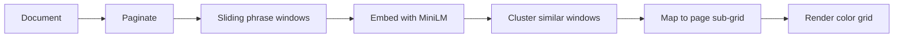

# Similarity Map

A visual tool for spotting repeated phrases and motifs in long-form prose — at a glance, across the whole manuscript, and down to the exact spot on each page.

Part of the **Romance Factory** manuscript tooling ecosystem.

## What it does

Upload a novel or long document and get a **repetition fingerprint**: a portrait-oriented grid where each cell is one page. Color shows *what* is repeating; brightness shows *how closely* it matches; position within each cell shows *where on the page* it appears.

The map helps authors and editors answer questions like:

- Which pages recycle the same phrases or scene beats?
- Is repetition clustered in one chapter or spread throughout?
- Are echoes exact duplicates, near-identical wording, or paraphrases?

## How it looks

The macro-grid is **10 columns wide** (like an open book), with rows growing with page count. Each page cell is a **20×20 pixel canvas** — one pixel per sub-region of the page, so you see both *that* a page repeats something and *where* on that page.

```
  page 1    page 2    page 3    ...    page 10
 ┌────────┐ ┌────────┐ ┌────────┐       ┌────────┐
 │ 20×20  │ │ 20×20  │ │ 20×20  │  ...  │ 20×20  │
 │ pixels │ │ pixels │ │ pixels │       │ pixels │
 └────────┘ └────────┘ └────────┘       └────────┘
```

**Color (hue)** — cluster identity: each recurring phrase/motif gets a distinct color.  
**Brightness (value)** — how archetypal the match is (brighter = closer to the cluster's core phrasing).  
**Empty pixels** — no repetition above the current threshold.

Hover for excerpts and similarity scores. Click a page or sub-region to drill into matching passages elsewhere in the document.

## How it works



1. **Import** — PDFs keep natural page breaks; plain text is split into configurable token-sized pages (~400 tokens ≈ one printed page).
2. **Window** — Overlapping text windows slide across each page (size and stride are adjustable).
3. **Embed** — Each window becomes a vector via a local embedding model (`all-MiniLM-L6-v2`, runs fully offline after first download).
4. **Cluster** — HDBSCAN finds organic repetition groups; KMeans assigns stable labels so colors stay consistent between runs.
5. **Visualize** — Windows map to a 20×20 sub-grid per page; clusters render as HSV-colored pixels with similarity-weighted blending when multiple motifs overlap.

### Detection scales

| Phrase length | Best for |
|---|---|
| 5–20 tokens | Repeated phrases and sentence fragments |
| 20–100 tokens | Sentences and short passages |
| **100–500 tokens** | **Paragraphs, scene beats, near-duplicate blocks** |
| 500–1500 tokens | Structural patterns (chapter openings, framing devices) |

Run twice at different phrase lengths (e.g. 20 and 200 tokens) to see both fine-grained echoes and large structural repetition.

## Features

- **Exact and fuzzy matching** — cosine similarity on embeddings catches paraphrases, not just copy-paste
- **Interactive controls** — tolerance slider, cluster filter, gamma tuning; display settings update instantly
- **Import settings with live estimates** — window count and embedding time before you commit to a long run
- **Progressive rendering** — the grid fills in page-by-page as analysis runs
- **Cancel and resume** — partial embedding progress is saved; resume compatible runs or start fresh
- **Session restore** — reopen a document and reload a previous map in seconds (no re-embedding)
- **Privacy-first** — local ONNX inference; manuscript text never leaves your machine

## Tech stack

| Layer | Technology |
|---|---|
| Shell | [Tauri 2](https://v2.tauri.app/) (Rust + WebView) |
| Backend | Rust — embedding, clustering, rasterization |
| Embeddings | ONNX Runtime, `all-MiniLM-L6-v2` |
| Vector store | [LanceDB](https://lancedb.com/) |
| Clustering | HDBSCAN + KMeans stabilization |
| Frontend | Vanilla JS + Canvas 2D |

## Building from source

### Prerequisites

- **Rust** (stable, 2021 edition) — [install via rustup](https://rustup.rs/)
- **Tauri CLI** — `cargo install tauri-cli --version "^2"`
- **ONNX Runtime (required)** — embedding uses the `ort` crate with dynamic loading. You need the ONNX Runtime **native shared library** installed separately from the downloaded `.onnx` model file. Without it, analysis will fail at startup (the app checks on launch).
  - macOS: `brew install onnxruntime`
  - Linux (Debian/Ubuntu): install a system `libonnxruntime` package, or build from [GitHub releases](https://github.com/microsoft/onnxruntime/releases)
  - If the library is not in a standard location, set the full path before running the app:
    ```bash
    export ORT_DYLIB_PATH="$(brew --prefix onnxruntime)/lib/libonnxruntime.dylib"   # macOS Homebrew
    ```
  - The app probes `ORT_DYLIB_PATH`, then common Homebrew paths (`/opt/homebrew/lib`, `/usr/local/lib` on macOS).
- **Protocol Buffers compiler (`protoc`)** — required at compile time by LanceDB (`lance-encoding` generates code from `.proto` files)
  - macOS: `brew install protobuf`
  - Linux (Debian/Ubuntu): `sudo apt install protobuf-compiler`
  - If `protoc` is installed but not found: `export PROTOC="$(brew --prefix protobuf)/bin/protoc"` (macOS Homebrew)
- **System dependencies** (macOS): Xcode Command Line Tools (`xcode-select --install`)
- **System dependencies** (Linux): `libwebkit2gtk-4.1-dev`, `libappindicator3-dev`, `librsvg2-dev`, `patchelf`

### Development

There are two ways to run the app while developing. The frontend is plain static files in `src/` — no bundler, `npm install`, or separate dev server required. Tauri serves `src/` directly via `frontendDist`.

**A. `cargo tauri dev`** — rebuilds Rust on change and reloads the webview (restart the app to pick up JS/CSS edits):

```bash
cd similarity-map
cargo tauri dev
```

**B. `cargo run`** — same static frontend, fastest if you are only changing Rust:

```bash
cd similarity-map/src-tauri
cargo run
```

To hot-reload frontend files without restarting Tauri, run a static server in another terminal and point the webview at it (optional):

```bash
python3 -m http.server 1420 --directory src
```

Then temporarily add `"devUrl": "http://localhost:1420"` to `src-tauri/tauri.conf.json` (and remove it again for normal dev).

### In-app debug log

There's a collapsible log drawer pinned to the bottom of the app window. It captures:

- All `console.log/info/warn/error` calls from frontend JS
- Unhandled errors and promise rejections
- `similarity-map:log` events emitted from the Rust backend (model load, pipeline stages, IPC commands, errors)

Use the **Level** dropdown to filter, **Copy** to paste a session into a bug report, and **Clear** to reset. From the JS console you can also call `window.logPanel.expand()` and `window.logPanel.log('info', 'me', 'hello')`.

### Running tests

```bash
# Run all Rust tests
cd src-tauri
cargo test
```

### Production build

```bash
# Build a release binary (output in src-tauri/target/release/bundle/)
cargo tauri build
```

This produces platform-specific installers (.dmg on macOS, .deb/.AppImage on Linux, .msi on Windows).

### Project structure

```
similarity-map/
├── similarity-core/        # Portable analysis library
├── similarity-cli/         # Headless CLI (AnalysisOutput JSON stdout)
├── src/                    # Frontend (Vanilla JS + CSS)
│   ├── index.html
│   ├── main.js
│   ├── grid.js             # Grid renderer (ImageBitmap compositing)
│   ├── zoom.js             # CSS transform zoom controller
│   ├── tolerance.js        # Frontend-only alpha mask
│   ├── dither.js           # Spatial dithering at high zoom
│   ├── import-settings.js  # Import parameter controls
│   ├── progress-view.js    # Multi-stage progress UI
│   ├── display-settings.js # Tolerance/gamma/cluster filter
│   ├── tooltip.js          # Hover tooltips
│   ├── detail-panel.js     # Click-to-inspect panel
│   ├── navigation.js       # Counterpart page navigation
│   ├── session-dialog.js   # Session restore modal
│   ├── model-download.js   # Model download progress
│   └── style.css
├── src-tauri/              # Rust backend
│   ├── Cargo.toml
│   └── src/
│       ├── main.rs
│       ├── lib.rs
│       ├── types.rs        # Core types and error enums
│       ├── commands.rs     # Tauri command handlers
│       ├── events.rs       # Event name constants
│       ├── pipeline.rs     # Full analysis orchestrator
│       ├── importer.rs     # PDF + plain text pagination
│       ├── windowing.rs    # Sliding window generation
│       ├── embedding.rs    # ONNX batch embedding
│       ├── clustering.rs   # HDBSCAN + KMeans stabilization
│       ├── centroid.rs     # Cluster registry computation
│       ├── subcell.rs      # Sub-cell position mapping
│       ├── color.rs        # HSV encoding + blending
│       ├── rasterizer.rs   # 20×20 RGBA canvas output
│       ├── storage/        # LanceDB schema + CRUD
│       ├── model.rs        # ONNX model download/verification
│       ├── benchmark.rs    # Throughput probe + time estimation
│       ├── hash.rs         # SHA-256 utilities
│       ├── cancellation.rs # Cancellation token registry
│       └── display_state.rs # Display state persistence
└── .kiro/specs/            # Design specification
```

### First run

On first launch the app will download the `all-MiniLM-L6-v2` ONNX model (~22 MB) from Hugging Face and cache it in your app data directory. Subsequent launches skip the download.

## Project status

Implementation is functionally complete. The full pipeline (import → embed → cluster → rasterize) is wired end-to-end with session persistence, cancellation/resume, and interactive display controls.

For the full technical specification (data model, IPC commands, clustering parameters, UI behavior, and performance notes), see [`Similarity Map - Design Specification.md`](./Similarity%20Map%20-%20Design%20Specification.md).

### Romance Factory JSON export (RepetitionReport v1)

Pipeline-consumable analysis output for the RF surgical editor is defined in [`.kiro/specs/similarity-map/integration-contract.md`](./.kiro/specs/similarity-map/integration-contract.md). Rust types: `similarity-core/src/contract.rs`. JSON Schema: `similarity-core/schemas/analysis_output_v1.schema.json`. Example fixture: `similarity-core/fixtures/analysis_output_v1.example.json`.

### Headless CLI (`similarity-cli`)

For debugging and pre-PyO3 pipeline integration, run repetition analysis without the Tauri UI:

```bash
cd similarity-map

# Romance Factory story chapter (loads drafts/chapter_NN.json or chapters/chapter_NN.md)
cargo run -p similarity-cli -- analyze \
  --story-path ../stories/my_novel \
  --chapter 1 \
  --pass-config similarity-cli/fixtures/pass_config_smoke.yaml \
  --test-embedder   # omit in production; use ONNX model instead

# JSON stdin: { "text", "scope_manifest", "params" }
cargo run -p similarity-cli -- analyze --test-embedder < request.json

# RF-style multi-pass bundle (YAML excerpt under generate:similarity_map:)
cargo run -p similarity-cli -- analyze \
  --story-path ../stories/my_novel \
  --chapter 3 \
  --pass-config similarity-cli/fixtures/pass_config_smoke.yaml \
  --test-embedder > chapter_03.repetition.json
```

**Output:** pretty-printed `AnalysisOutput` v1 JSON on stdout (contract in `integration-contract.md`). Errors go to stderr.

**Flags:**

| Flag | Description |
|---|---|
| `--story-path` + `--chapter` | Load RF chapter prose and build `scope_manifest` automatically |
| `--input-file` | Read `{ text, scope_manifest, params }` JSON from a file |
| `--pass-config` | YAML pass bundle (`min_repetitions`, `passes[]` with `window_size` / `stride`) |
| `--expand-sentences` / `--no-expand-sentences` | Clip spans to sentence boundaries (default: expand) |
| `--model-path` | ONNX model path (or set `SIMILARITY_MAP_MODEL_PATH`) |
| `--window-size`, `--stride`, … | Single-pass overrides when `--pass-config` is omitted |

**Production runs** require the `all-MiniLM-L6-v2` ONNX model (same as the desktop app). Point `--model-path` at the cached file or set `SIMILARITY_MAP_DATA_DIR` / `SIMILARITY_MAP_MODEL_PATH`.

### PyO3 Python bindings (`similarity-core-py`)

Direct pipeline integration without Tauri or subprocess CLI:

```bash
cd similarity-map/similarity-core-py
pip install maturin   # once
maturin develop       # builds and installs editable `similarity_core` package
```

```python
import similarity_core

result = similarity_core.analyze_prose(
    text,
    scope_manifest,   # dict — act/paragraph index from build_scope_manifest
    params,             # dict — window_size, stride, min_repetitions, …
    test_embedder=True, # omit in production; uses ONNX model
)
# result is AnalysisOutput v1 (JSON-serializable dict)

result = similarity_core.analyze_prose_multi_pass(
    text,
    scope_manifest,
    pass_config,        # dict — MultiPassConfig (passes[], min_repetitions, …)
    test_embedder=True,
)
```

**Model path resolution** (production ONNX runs):

| Env var | Effect |
|---|---|
| `SIMILARITY_MAP_MODEL_PATH` | Full path to `all-MiniLM-L6-v2.onnx` |
| `SIMILARITY_MAP_MODEL_DIR` | Directory containing the model (or `models/` subdir) |
| `SIMILARITY_MAP_DATA_DIR` | App-data root (default: `~/Library/Application Support` on macOS) |

Tests (offline, no ONNX):

```bash
cd similarity-map/similarity-core-py
maturin develop
pytest tests/test_analyze_prose.py -v
```

### Headless pipeline & ONNX Runtime

Headless runs (CLI, PyO3 in Romance Factory, CI) need the **ONNX Runtime native shared library** in addition to the downloaded `.onnx` embedding model. The Rust `ort` crate uses **dynamic loading** (`load-dynamic`); the dylib must exist before any session API runs.

**Version requirement:** `similarity-core` depends on `ort` 2.0.0-rc.12, which targets **ONNX Runtime 1.24.x**. Do not use 1.20.x or other mismatched builds — embedding often stalls at 0% with no useful error.

#### Install paths (probed automatically)

`similarity-core/src/ort_runtime.rs` searches in order:

1. **`ORT_DYLIB_PATH`** — full path to the shared library (always preferred in CI and non-standard installs)
2. Platform defaults (only if `ORT_DYLIB_PATH` is unset):

| OS | Default probe paths |
|---|---|
| **macOS** | `/opt/homebrew/lib/libonnxruntime.dylib`, `/usr/local/lib/libonnxruntime.dylib` |
| **Linux** | `/usr/lib/x86_64-linux-gnu/libonnxruntime.so`, `/usr/lib/aarch64-linux-gnu/libonnxruntime.so`, `/usr/local/lib/libonnxruntime.so`, `/usr/lib/libonnxruntime.so` |

#### macOS install

```bash
brew install onnxruntime
export ORT_DYLIB_PATH="$(brew --prefix onnxruntime)/lib/libonnxruntime.dylib"
```

Apple Silicon Homebrew also installs under `/opt/homebrew/lib/` (included in auto-probe).

#### Linux install

**Option A — GitHub release (recommended for CI and pinned version):**

```bash
ORT_VERSION=1.24.2
curl -fsSL "https://github.com/microsoft/onnxruntime/releases/download/v${ORT_VERSION}/onnxruntime-linux-x64-${ORT_VERSION}.tgz" \
  | tar xz -C /tmp
sudo cp /tmp/onnxruntime-linux-x64-${ORT_VERSION}/lib/libonnxruntime.so* /usr/local/lib/
export ORT_DYLIB_PATH=/usr/local/lib/libonnxruntime.so
```

Use `onnxruntime-linux-aarch64-${ORT_VERSION}.tgz` on arm64.

**Option B — distro package** (verify version ≥ 1.24 before relying on it):

```bash
# Debian/Ubuntu — package version varies; prefer Option A if embedding hangs
sudo apt install libonnxruntime libonnxruntime-dev
export ORT_DYLIB_PATH=/usr/lib/x86_64-linux-gnu/libonnxruntime.so
```

Romance Factory provides `./scripts/ci_install_onnxruntime.sh` (repo root) for macOS Homebrew or Linux x64/aarch64 release install.

#### Embedding model (`.onnx` file)

Separate from ONNX Runtime — this is the MiniLM weights file (~23 MB quantized):

| Env var | Effect |
|---|---|
| `SIMILARITY_MAP_MODEL_PATH` | Full path to `all-MiniLM-L6-v2.onnx` |
| `SIMILARITY_MAP_MODEL_DIR` | Directory containing the model (or `models/` subdir) |
| `SIMILARITY_MAP_DATA_DIR` | App-data root (desktop default: `~/Library/Application Support` on macOS, `~/.local/share` on Linux) |

**CI / headless download example:**

```bash
export SIMILARITY_MAP_MODEL_DIR="$HOME/.cache/similarity-map/models"
mkdir -p "$SIMILARITY_MAP_MODEL_DIR"
curl -fsSL \
  "https://huggingface.co/sentence-transformers/all-MiniLM-L6-v2/resolve/main/onnx/model_quint8_avx2.onnx" \
  -o "$SIMILARITY_MAP_MODEL_DIR/all-MiniLM-L6-v2.onnx"
```

Use `model_qint8_arm64.onnx` on Apple Silicon if you download manually from Hugging Face.

#### Romance Factory CI

Optional workflow: romance-factory [`.github/workflows/similarity-map-ci.yml`](../.github/workflows/similarity-map-ci.yml). Enable weekly runs by setting repository variable **`SIMILARITY_MAP_CI=1`**, or trigger manually from Actions. See [`docs/design/similarity-map-onnx-ci.md`](../docs/design/similarity-map-onnx-ci.md).

#### Troubleshooting

| Symptom | Likely cause | Fix |
|---|---|---|
| `ONNX Runtime shared library (…) not found` | Dylib missing | Install 1.24.x; set `ORT_DYLIB_PATH` |
| Progress stuck at 0% during embed | ORT **version mismatch** | Use ONNX Runtime 1.24.x, not 1.20.x |
| `Failed to load ONNX Runtime from …` | Wrong arch or corrupt dylib | Reinstall; confirm `file "$ORT_DYLIB_PATH"` matches your CPU |
| `ONNX model not found at …` | Model not cached | Set `SIMILARITY_MAP_MODEL_DIR` or download `.onnx` (see above) |
| PyO3 `import similarity_core` fails | Extension not built | From romance-factory root: `./scripts/build_similarity_core.sh` |
| `test_embedder=True` works, production fails | Missing ORT or model | Expected — offline tests skip native deps |


## License

MIT — see [LICENSE](./LICENSE).
